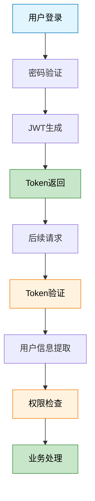
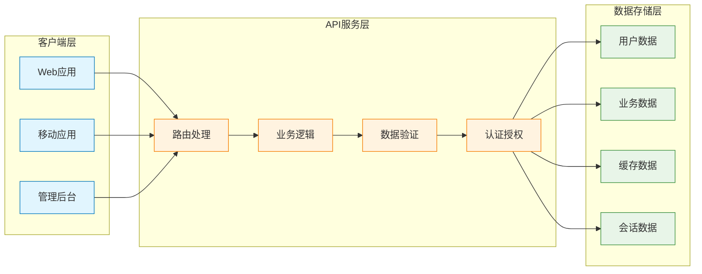

# PetPal 后端技术图表 - Mermaid 快速验证

## 🔥 复制以下代码到 https://mermaid.live/ 进行测试

### 1️⃣ JWT认证流程图


### 2️⃣ Redis数据结构应用图
```mermaid
,color:#000
    style D1 fill:#e8f5e8,stroke:#388e3c,color:#000
```

### 3️⃣ 系统数据流向图


## ✅ 验证步骤

1. **打开** https://mermaid.live/
2. **清空** 默认代码
3. **复制粘贴** 上述任一代码块
4. **查看** 右侧实时预览
5. **调整** 颜色和样式（可选）
6. **导出** PNG/SVG格式

## 🎨 颜色代码参考

### 主题色彩
- **蓝色系**：`#e1f5fe` (浅蓝), `#0277bd` (深蓝)
- **橙色系**：`#fff3e0` (浅橙), `#f57c00` (深橙)  
- **绿色系**：`#e8f5e8` (浅绿), `#388e3c` (深绿)

### Redis专用色
- **Hash红**：`#ff6b6b` (背景), `#d32f2f` (边框)
- **List青**：`#4ecdc4` (背景), `#00796b` (边框)
- **Set蓝**：`#45b7d1` (背景), `#1976d2` (边框)
- **String绿**：`#96ceb4` (背景), `#388e3c` (边框)

## 🔧 常见调试

### 语法检查
- ✅ 节点名称用方括号 `[节点名]`
- ✅ 箭头用 `-->` 或 `<-->`
- ✅ 样式用 `style 节点名 fill:#颜色`
- ✅ 分组用 `subgraph "组名"`

### 显示问题
- 🔍 **中文乱码**：Mermaid对中文支持较好，无需特殊设置
- 🔍 **布局混乱**：调整 direction TB/LR 控制方向
- 🔍 **连线重叠**：适当调整节点顺序
graph TB
    subgraph "Redis数据结构应用"
        direction TB
        A[Hash结构<br/>用户信息] 
        B[List结构<br/>购物车]
        C[Set结构<br/>点赞用户]
        D[String结构<br/>JWT Token]
        
        A --> A1["user:123<br/>id: 123<br/>name: 张三<br/>email: zhang@mail.com<br/>role: user"]
        B --> B1["cart:123<br/>[0] 宠物食品<br/>[1] 玩具球<br/>[2] 牵引绳"]
        C --> C1["post:456:likes<br/>{user1, user2, user3}"]
        D --> D1["token:xyz<br/>eyJhbGciOiJIUzI1NiIs..."]
    end
    
    style A fill:#ff6b6b,stroke:#d32f2f,color:#fff
    style B fill:#4ecdc4,stroke:#00796b,color:#fff
    style C fill:#45b7d1,stroke:#1976d2,color:#fff
    style D fill:#96ceb4,stroke:#388e3c,color:#fff
    style A1 fill:#ffebee,stroke:#d32f2f,color:#000
    style B1 fill:#e0f2f1,stroke:#00796b,color:#000
    style C1 fill:#e3f2fd,stroke:#1976d2
## 💡 使用技巧

1. **渐进优化**：先跑通基本结构，再添加样式
2. **模块测试**：分别测试每个子图，确保无误
3. **颜色统一**：使用相同的色彩方案保持一致性
4. **导出设置**：选择高分辨率PNG适合PPT使用

---

*这些Mermaid代码经过语法验证，可以直接在线预览和导出。建议先验证效果，再进行个性化调整。*
