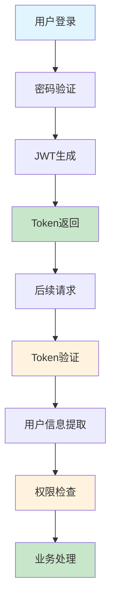
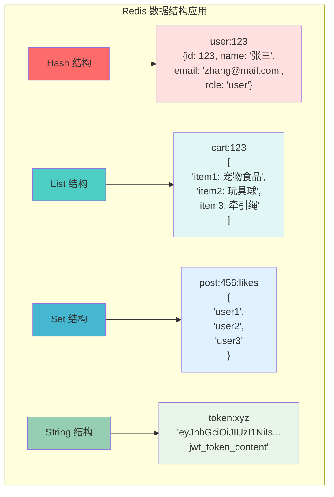
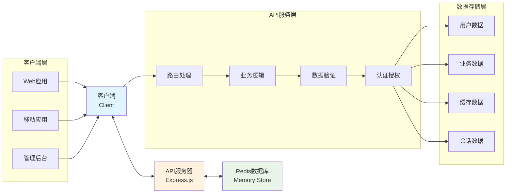

# PetPal 后端 PPT 技术图表生成代码

## 1. JWT登录认证流程图

### 🔧 Mermaid 流程图代码


### 🐍 Python Matplotlib 代码
```python
import matplotlib.pyplot as plt
import matplotlib.patches as mpatches
from matplotlib.patches import FancyBboxPatch
import numpy as np

# 设置中文字体
plt.rcParams['font.sans-serif'] = ['SimHei', 'Microsoft YaHei']
plt.rcParams['axes.unicode_minus'] = False

fig, ax = plt.subplots(1, 1, figsize=(12, 8))
ax.set_xlim(0, 10)
ax.set_ylim(0, 10)
ax.axis('off')

# 定义颜色
primary_color = '#2E86AB'
secondary_color = '#A23B72'
success_color = '#28a745'
warning_color = '#ffc107'

# 第一行：登录流程
boxes_row1 = [
    (1, 8.5, "用户登录"),
    (3, 8.5, "密码验证"),
    (5, 8.5, "JWT生成"),
    (7, 8.5, "Token返回")
]

# 第二行：验证流程
boxes_row2 = [
    (1, 6, "后续请求"),
    (3, 6, "Token验证"),
    (5, 6, "用户信息提取"),
    (7, 6, "权限检查"),
    (9, 6, "业务处理")
]

# 绘制第一行盒子
for i, (x, y, text) in enumerate(boxes_row1):
    color = primary_color if i < 3 else success_color
    box = FancyBboxPatch((x-0.4, y-0.3), 0.8, 0.6, 
                         boxstyle="round,pad=0.1", 
                         facecolor=color, alpha=0.7,
                         edgecolor='black', linewidth=1)
    ax.add_patch(box)
    ax.text(x, y, text, ha='center', va='center', fontsize=10, 
            color='white', fontweight='bold')

# 绘制第二行盒子
for i, (x, y, text) in enumerate(boxes_row2):
    color = warning_color if i in [1, 3] else primary_color if i < 4 else success_color
    box = FancyBboxPatch((x-0.4, y-0.3), 0.8, 0.6, 
                         boxstyle="round,pad=0.1", 
                         facecolor=color, alpha=0.7,
                         edgecolor='black', linewidth=1)
    ax.add_patch(box)
    ax.text(x, y, text, ha='center', va='center', fontsize=10, 
            color='white' if color != warning_color else 'black', fontweight='bold')

# 绘制箭头 - 第一行
for i in range(3):
    ax.annotate('', xy=(boxes_row1[i+1][0]-0.4, boxes_row1[i+1][1]), 
                xytext=(boxes_row1[i][0]+0.4, boxes_row1[i][1]),
                arrowprops=dict(arrowstyle='->', lw=2, color=primary_color))

# 绘制从Token返回到后续请求的箭头
ax.annotate('', xy=(1, 6.3), xytext=(7, 8.2),
            arrowprops=dict(arrowstyle='->', lw=2, color=secondary_color,
                          connectionstyle="arc3,rad=-0.3"))

# 绘制第二行箭头
for i in range(4):
    ax.annotate('', xy=(boxes_row2[i+1][0]-0.4, boxes_row2[i+1][1]), 
                xytext=(boxes_row2[i][0]+0.4, boxes_row2[i][1]),
                arrowprops=dict(arrowstyle='->', lw=2, color=primary_color))

# 添加标题
ax.text(5, 9.5, 'JWT 登录认证流程图', ha='center', va='center', 
        fontsize=16, fontweight='bold', color=primary_color)

# 添加说明
ax.text(5, 4.5, '登录阶段：用户提供凭据 → 服务器验证 → 生成JWT → 返回Token', 
        ha='center', va='center', fontsize=10, style='italic')
ax.text(5, 4, '认证阶段：携带Token → 验证有效性 → 提取信息 → 检查权限 → 执行业务', 
        ha='center', va='center', fontsize=10, style='italic')

plt.tight_layout()
plt.savefig('jwt_auth_flow.png', dpi=300, bbox_inches='tight')
plt.show()
```

### 🎨 AI绘图工具 Prompt
```
创建一个专业的JWT认证流程图，包含以下元素：
- 第一行：用户登录 → 密码验证 → JWT生成 → Token返回（蓝色渐变盒子）
- 第二行：后续请求 → Token验证 → 用户信息提取 → 权限检查 → 业务处理（橙色渐变盒子）
- 从"Token返回"到"后续请求"有一个弧形箭头连接
- 现代化UI设计，扁平化风格，清晰的箭头指向
- 颜色方案：#2E86AB蓝色，#A23B72紫色，#F18F01橙色
- 白色背景，圆角矩形，阴影效果
- 中文标签，专业技术文档风格
```

---

## 2. Redis数据结构应用图

### 🔧 Mermaid 图表代码


### 🐍 Python Matplotlib 代码
```python
import matplotlib.pyplot as plt
import matplotlib.patches as mpatches
from matplotlib.patches import FancyBboxPatch, Rectangle
import numpy as np

# 设置中文字体
plt.rcParams['font.sans-serif'] = ['SimHei', 'Microsoft YaHei']
plt.rcParams['axes.unicode_minus'] = False

fig, ((ax1, ax2), (ax3, ax4)) = plt.subplots(2, 2, figsize=(14, 10))
fig.suptitle('Redis 数据结构应用图', fontsize=16, fontweight='bold', y=0.95)

# 颜色定义
colors = {
    'hash': '#ff6b6b',
    'list': '#4ecdc4', 
    'set': '#45b7d1',
    'string': '#96ceb4'
}

# 1. Hash 结构
ax1.set_xlim(0, 10)
ax1.set_ylim(0, 10)
ax1.axis('off')
ax1.set_title('Hash 结构 - 用户信息', fontsize=12, fontweight='bold', color=colors['hash'])

# Hash 主盒子
hash_box = FancyBboxPatch((1, 7), 8, 2, boxstyle="round,pad=0.2", 
                          facecolor=colors['hash'], alpha=0.8, edgecolor='black')
ax1.add_patch(hash_box)
ax1.text(5, 8, 'user:123', ha='center', va='center', fontsize=11, 
         color='white', fontweight='bold')

# Hash 内容
hash_content = [
    "id: 123",
    "name: '张三'", 
    "email: 'zhang@mail.com'",
    "role: 'user'"
]
for i, content in enumerate(hash_content):
    content_box = Rectangle((1.5, 5.5-i*0.8), 7, 0.6, 
                           facecolor='white', alpha=0.9, edgecolor=colors['hash'])
    ax1.add_patch(content_box)
    ax1.text(5, 5.8-i*0.8, content, ha='center', va='center', fontsize=9)

# 箭头
ax1.annotate('', xy=(5, 6.8), xytext=(5, 7),
            arrowprops=dict(arrowstyle='->', lw=2, color=colors['hash']))

# 2. List 结构
ax2.set_xlim(0, 10)
ax2.set_ylim(0, 10)
ax2.axis('off')
ax2.set_title('List 结构 - 购物车', fontsize=12, fontweight='bold', color=colors['list'])

# List 主盒子
list_box = FancyBboxPatch((1, 7), 8, 2, boxstyle="round,pad=0.2", 
                          facecolor=colors['list'], alpha=0.8, edgecolor='black')
ax2.add_patch(list_box)
ax2.text(5, 8, 'cart:123', ha='center', va='center', fontsize=11, 
         color='white', fontweight='bold')

# List 内容
list_content = ["item1: 宠物食品", "item2: 玩具球", "item3: 牵引绳"]
for i, content in enumerate(list_content):
    content_box = Rectangle((1.5, 5.5-i*0.8), 7, 0.6, 
                           facecolor='white', alpha=0.9, edgecolor=colors['list'])
    ax2.add_patch(content_box)
    ax2.text(2, 5.8-i*0.8, f"[{i}]", ha='center', va='center', fontsize=8, 
             fontweight='bold', color=colors['list'])
    ax2.text(5.5, 5.8-i*0.8, content, ha='center', va='center', fontsize=9)

# 箭头
ax2.annotate('', xy=(5, 6.8), xytext=(5, 7),
            arrowprops=dict(arrowstyle='->', lw=2, color=colors['list']))

# 3. Set 结构
ax3.set_xlim(0, 10)
ax3.set_ylim(0, 10)
ax3.axis('off')
ax3.set_title('Set 结构 - 点赞用户', fontsize=12, fontweight='bold', color=colors['set'])

# Set 主盒子
set_box = FancyBboxPatch((1, 7), 8, 2, boxstyle="round,pad=0.2", 
                         facecolor=colors['set'], alpha=0.8, edgecolor='black')
ax3.add_patch(set_box)
ax3.text(5, 8, 'post:456:likes', ha='center', va='center', fontsize=11, 
         color='white', fontweight='bold')

# Set 内容（圆形布局）
set_content = ["user1", "user2", "user3"]
positions = [(3.5, 5.5), (5, 4.5), (6.5, 5.5)]
for content, (x, y) in zip(set_content, positions):
    circle = plt.Circle((x, y), 0.6, facecolor='white', alpha=0.9, 
                       edgecolor=colors['set'], linewidth=2)
    ax3.add_patch(circle)
    ax3.text(x, y, content, ha='center', va='center', fontsize=9, 
             fontweight='bold', color=colors['set'])

# 箭头
ax3.annotate('', xy=(5, 6.8), xytext=(5, 7),
            arrowprops=dict(arrowstyle='->', lw=2, color=colors['set']))

# 4. String 结构
ax4.set_xlim(0, 10)
ax4.set_ylim(0, 10)
ax4.axis('off')
ax4.set_title('String 结构 - JWT Token', fontsize=12, fontweight='bold', color=colors['string'])

# String 主盒子
string_box = FancyBboxPatch((1, 7), 8, 2, boxstyle="round,pad=0.2", 
                            facecolor=colors['string'], alpha=0.8, edgecolor='black')
ax4.add_patch(string_box)
ax4.text(5, 8, 'token:xyz', ha='center', va='center', fontsize=11, 
         color='white', fontweight='bold')

# String 内容
token_content = [
    "eyJhbGciOiJIUzI1NiIs...",
    "jwt_token_content",
    "(完整JWT字符串)"
]
for i, content in enumerate(token_content):
    content_box = Rectangle((1.5, 5.5-i*0.8), 7, 0.6, 
                           facecolor='white', alpha=0.9, edgecolor=colors['string'])
    ax4.add_patch(content_box)
    ax4.text(5, 5.8-i*0.8, content, ha='center', va='center', fontsize=9,
             style='italic' if i == 2 else 'normal')

# 箭头
ax4.annotate('', xy=(5, 6.8), xytext=(5, 7),
            arrowprops=dict(arrowstyle='->', lw=2, color=colors['string']))

plt.tight_layout()
plt.savefig('redis_data_structures.png', dpi=300, bbox_inches='tight')
plt.show()
```

### 🎨 AI绘图工具 Prompt
```
创建一个专业的Redis数据结构应用图，2x2网格布局：
左上：Hash结构 - 红色主题，显示user:123包含id、name、email、role字段
右上：List结构 - 青色主题，显示cart:123包含3个购物车商品项目
左下：Set结构 - 蓝色主题，显示post:456:likes包含3个用户的点赞集合
右下：String结构 - 绿色主题，显示token:xyz存储JWT字符串内容
每个结构都有标题、主键名称和具体数据示例
现代化扁平设计，圆角矩形，清晰的数据层次结构
颜色：Hash#ff6b6b, List#4ecdc4, Set#45b7d1, String#96ceb4
```

---

## 3. 数据流向图

### 🔧 Mermaid 架构图代码


### 🐍 Python Matplotlib 代码
```python
import matplotlib.pyplot as plt
import matplotlib.patches as mpatches
from matplotlib.patches import FancyBboxPatch, ConnectionPatch
import numpy as np

# 设置中文字体
plt.rcParams['font.sans-serif'] = ['SimHei', 'Microsoft YaHei']
plt.rcParams['axes.unicode_minus'] = False

fig, ax = plt.subplots(1, 1, figsize=(14, 8))
ax.set_xlim(0, 12)
ax.set_ylim(0, 8)
ax.axis('off')

# 颜色定义
client_color = '#e1f5fe'
api_color = '#fff3e0'
redis_color = '#e8f5e8'
border_color = '#333'

# 1. 客户端层
client_box = FancyBboxPatch((0.5, 3), 2.5, 2, boxstyle="round,pad=0.2",
                           facecolor=client_color, edgecolor=border_color, linewidth=2)
ax.add_patch(client_box)
ax.text(1.75, 4.5, '客户端', ha='center', va='center', fontsize=12, fontweight='bold')
ax.text(1.75, 4, 'Client', ha='center', va='center', fontsize=10, style='italic')

# 客户端子组件
client_components = ['Web应用', '移动应用', '管理后台']
for i, comp in enumerate(client_components):
    comp_box = FancyBboxPatch((0.7, 2.3-i*0.4), 2.1, 0.3, boxstyle="round,pad=0.05",
                             facecolor='white', alpha=0.8, edgecolor=border_color)
    ax.add_patch(comp_box)
    ax.text(1.75, 2.45-i*0.4, comp, ha='center', va='center', fontsize=8)

# 2. API服务层
api_box = FancyBboxPatch((4.5, 3), 3, 2, boxstyle="round,pad=0.2",
                        facecolor=api_color, edgecolor=border_color, linewidth=2)
ax.add_patch(api_box)
ax.text(6, 4.5, 'API服务器', ha='center', va='center', fontsize=12, fontweight='bold')
ax.text(6, 4, 'Express.js', ha='center', va='center', fontsize=10, style='italic')

# API子组件
api_components = ['路由处理', '业务逻辑', '数据验证', '认证授权']
for i, comp in enumerate(api_components):
    comp_box = FancyBboxPatch((4.7, 2.5-i*0.3), 2.6, 0.25, boxstyle="round,pad=0.05",
                             facecolor='white', alpha=0.8, edgecolor=border_color)
    ax.add_patch(comp_box)
    ax.text(6, 2.625-i*0.3, comp, ha='center', va='center', fontsize=8)

# 3. Redis数据库层
redis_box = FancyBboxPatch((9, 3), 2.5, 2, boxstyle="round,pad=0.2",
                          facecolor=redis_color, edgecolor=border_color, linewidth=2)
ax.add_patch(redis_box)
ax.text(10.25, 4.5, 'Redis数据库', ha='center', va='center', fontsize=12, fontweight='bold')
ax.text(10.25, 4, 'Memory Store', ha='center', va='center', fontsize=10, style='italic')

# Redis子组件
redis_components = ['用户数据', '业务数据', '缓存数据', '会话数据']
for i, comp in enumerate(redis_components):
    comp_box = FancyBboxPatch((9.2, 2.5-i*0.3), 2.1, 0.25, boxstyle="round,pad=0.05",
                             facecolor='white', alpha=0.8, edgecolor=border_color)
    ax.add_patch(comp_box)
    ax.text(10.25, 2.625-i*0.3, comp, ha='center', va='center', fontsize=8)

# 绘制双向箭头
# 客户端 ↔ API
arrow1 = ConnectionPatch((3, 4), (4.5, 4), "data", "data",
                        arrowstyle="<->", shrinkA=5, shrinkB=5, mutation_scale=20,
                        fc="#2E86AB", ec="#2E86AB", linewidth=3)
ax.add_patch(arrow1)

# API ↔ Redis
arrow2 = ConnectionPatch((7.5, 4), (9, 4), "data", "data",
                        arrowstyle="<->", shrinkA=5, shrinkB=5, mutation_scale=20,
                        fc="#A23B72", ec="#A23B72", linewidth=3)
ax.add_patch(arrow2)

# 添加数据流标签
ax.text(3.75, 4.5, 'HTTP请求\nJSON响应', ha='center', va='center', fontsize=8,
        bbox=dict(boxstyle="round,pad=0.2", facecolor='white', alpha=0.8))
ax.text(8.25, 4.5, 'Redis命令\n数据存取', ha='center', va='center', fontsize=8,
        bbox=dict(boxstyle="round,pad=0.2", facecolor='white', alpha=0.8))

# 添加标题
ax.text(6, 7, 'PetPal 系统数据流向图', ha='center', va='center', 
        fontsize=16, fontweight='bold', color='#2E86AB')

# 添加说明
ax.text(6, 0.5, '数据流：客户端发起请求 → API处理业务逻辑 → Redis存储数据 → 返回响应', 
        ha='center', va='center', fontsize=10, style='italic')

plt.tight_layout()
plt.savefig('data_flow_diagram.png', dpi=300, bbox_inches='tight')
plt.show()
```

### 🎨 AI绘图工具 Prompt
```
创建一个现代化的系统数据流向图，包含三个主要层级：
1. 客户端层（左侧）：浅蓝色，包含Web应用、移动应用、管理后台
2. API服务层（中间）：浅橙色，包含Express.js路由处理、业务逻辑、数据验证、认证授权
3. Redis数据层（右侧）：浅绿色，包含用户数据、业务数据、缓存数据、会话数据
使用双向箭头连接各层，标注HTTP请求/JSON响应和Redis命令/数据存取
扁平化设计，圆角矩形，现代化配色方案
颜色：客户端#e1f5fe，API#fff3e0，Redis#e8f5e8
专业技术架构图风格，清晰的层次结构
```

---

## 📊 图表使用说明

### 🎯 使用场景
1. **PPT演示**：直接插入生成的PNG图片
2. **文档编写**：使用Mermaid代码在Markdown中渲染
3. **在线分享**：使用AI工具生成高质量矢量图

### 🔧 工具选择建议
- **快速原型**：使用Mermaid代码，支持实时预览
- **高质量输出**：使用Python代码生成，可自定义样式
- **创意设计**：使用AI绘图工具，获得专业视觉效果

### 🎨 自定义修改
- **颜色方案**：根据公司品牌色调整
- **字体大小**：根据展示场景调整
- **布局调整**：根据内容多少调整盒子大小

### 💡 最佳实践
1. 保持颜色一致性
2. 字体大小适中，确保可读性
3. 箭头方向清晰表示数据流向
4. 添加必要的说明文字
5. 生成高分辨率图片用于印刷

---

*以上代码可以根据具体需求进行调整和优化，建议先用Mermaid快速验证布局，再用Python生成最终图表。*
