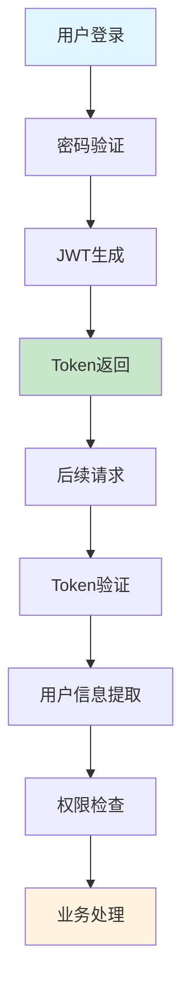
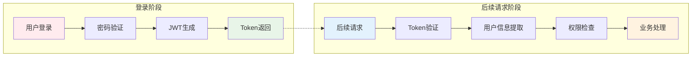
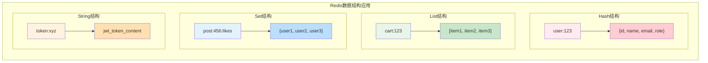
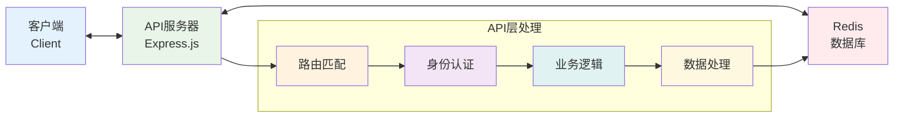
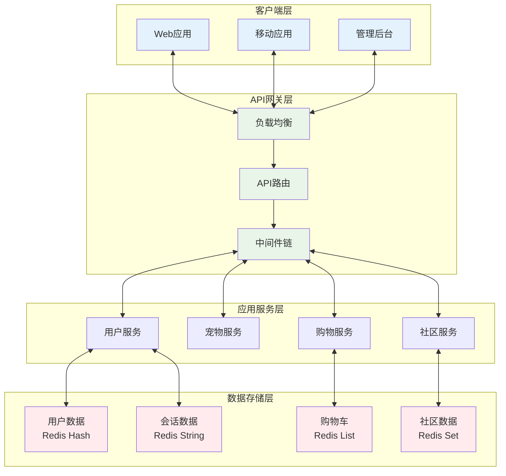

# PetPal 后端PPT图表生成代码和Prompt

## 1. JWT登录认证流程图

### 🔹 Mermaid图表代码


### 🔹 增强版Mermaid（S型布局）


### 🔹 Python可视化代码
```python
import matplotlib.pyplot as plt
import matplotlib.patches as mpatches
from matplotlib.patches import FancyBboxPatch
import numpy as np

# 设置中文字体
plt.rcParams['font.sans-serif'] = ['SimHei', 'DejaVu Sans']
plt.rcParams['axes.unicode_minus'] = False

fig, ax = plt.subplots(1, 1, figsize=(14, 8))

# 定义步骤和位置
steps_login = ['用户登录', '密码验证', 'JWT生成', 'Token返回']
steps_request = ['后续请求', 'Token验证', '用户信息提取', '权限检查', '业务处理']

# 登录流程位置
login_x = np.arange(len(steps_login))
login_y = [3] * len(steps_login)

# 后续请求流程位置
request_x = np.arange(len(steps_request))
request_y = [1] * len(steps_request)

# 绘制登录流程
for i, (x, y, step) in enumerate(zip(login_x, login_y, steps_login)):
    # 绘制矩形框
    color = '#E3F2FD' if i % 2 == 0 else '#E8F5E8'
    rect = FancyBboxPatch((x-0.4, y-0.3), 0.8, 0.6, 
                         boxstyle="round,pad=0.1", 
                         facecolor=color, 
                         edgecolor='#1976D2',
                         linewidth=2)
    ax.add_patch(rect)
    
    # 添加文字
    ax.text(x, y, step, ha='center', va='center', fontsize=11, fontweight='bold')
    
    # 添加箭头
    if i < len(steps_login) - 1:
        ax.annotate('', xy=(x+0.5, y), xytext=(x+0.4, y),
                   arrowprops=dict(arrowstyle='->', lw=2, color='#1976D2'))

# 绘制后续请求流程
for i, (x, y, step) in enumerate(zip(request_x, request_y, steps_request)):
    color = '#FFF3E0' if i % 2 == 0 else '#FFEBEE'
    rect = FancyBboxPatch((x-0.4, y-0.3), 0.8, 0.6,
                         boxstyle="round,pad=0.1",
                         facecolor=color,
                         edgecolor='#FF7043',
                         linewidth=2)
    ax.add_patch(rect)
    
    ax.text(x, y, step, ha='center', va='center', fontsize=11, fontweight='bold')
    
    if i < len(steps_request) - 1:
        ax.annotate('', xy=(x+0.5, y), xytext=(x+0.4, y),
                   arrowprops=dict(arrowstyle='->', lw=2, color='#FF7043'))

# 连接两个流程的箭头
ax.annotate('', xy=(0, 1.5), xytext=(3, 2.5),
           arrowprops=dict(arrowstyle='->', lw=3, color='#4CAF50',
                          connectionstyle="arc3,rad=0.3"))

# 设置图形属性
ax.set_xlim(-0.8, 4.8)
ax.set_ylim(0, 4)
ax.set_aspect('equal')
ax.axis('off')

# 添加标题
plt.title('JWT认证流程图', fontsize=16, fontweight='bold', pad=20)

# 添加图例
login_patch = mpatches.Patch(color='#E3F2FD', label='登录阶段')
request_patch = mpatches.Patch(color='#FFF3E0', label='后续请求阶段')
plt.legend(handles=[login_patch, request_patch], loc='upper right')

plt.tight_layout()
plt.savefig('/home/devbox/project/jwt_flow_chart.png', dpi=300, bbox_inches='tight')
plt.show()
```

### 🔹 AI绘图工具Prompt
**适用于：Midjourney, DALL-E, Stable Diffusion**

```
Create a professional technical diagram showing JWT authentication flow:
- Clean modern design with rounded rectangles
- Blue color scheme (#2196F3, #E3F2FD)
- Two phases: Login phase (top row) and Subsequent requests phase (bottom row)
- Login phase: User Login → Password Verification → JWT Generation → Token Return
- Request phase: Subsequent Request → Token Verification → User Info Extraction → Permission Check → Business Processing
- Curved arrow connecting the two phases
- Technical style, minimalist, suitable for PowerPoint presentation
- Chinese text labels with clean sans-serif font
- White background with subtle shadows
```

---

## 2. Redis数据结构应用图

### 🔹 Mermaid图表代码


### 🔹 Python可视化代码
```python
import matplotlib.pyplot as plt
import matplotlib.patches as mpatches
from matplotlib.patches import FancyBboxPatch, Rectangle
import numpy as np

plt.rcParams['font.sans-serif'] = ['SimHei', 'DejaVu Sans']
plt.rcParams['axes.unicode_minus'] = False

fig, ax = plt.subplots(1, 1, figsize=(16, 10))

# 定义数据结构
structures = [
    {
        'type': 'Hash',
        'key': 'user:123',
        'value': '{id, name, email, role}',
        'color': '#FFEBEE',
        'border': '#E91E63',
        'pos': (2, 7)
    },
    {
        'type': 'List',
        'key': 'cart:123',
        'value': '[item1, item2, item3]',
        'color': '#E8F5E8',
        'border': '#4CAF50',
        'pos': (8, 7)
    },
    {
        'type': 'Set',
        'key': 'post:456:likes',
        'value': '{user1, user2, user3}',
        'color': '#E3F2FD',
        'border': '#2196F3',
        'pos': (2, 3)
    },
    {
        'type': 'String',
        'key': 'token:xyz',
        'value': 'jwt_token_content',
        'color': '#FFF3E0',
        'border': '#FF9800',
        'pos': (8, 3)
    }
]

# 绘制每个数据结构
for struct in structures:
    x, y = struct['pos']
    
    # 绘制数据类型标题
    title_rect = FancyBboxPatch((x-1.5, y+1), 3, 0.6,
                               boxstyle="round,pad=0.1",
                               facecolor=struct['border'],
                               edgecolor=struct['border'],
                               alpha=0.8)
    ax.add_patch(title_rect)
    ax.text(x, y+1.3, f"Redis {struct['type']}", ha='center', va='center',
           fontsize=14, fontweight='bold', color='white')
    
    # 绘制Key框
    key_rect = FancyBboxPatch((x-1.5, y), 3, 0.6,
                             boxstyle="round,pad=0.1",
                             facecolor='white',
                             edgecolor=struct['border'],
                             linewidth=2)
    ax.add_patch(key_rect)
    ax.text(x, y+0.3, struct['key'], ha='center', va='center',
           fontsize=12, fontweight='bold')
    
    # 绘制Value框
    value_rect = FancyBboxPatch((x-1.5, y-1), 3, 0.6,
                               boxstyle="round,pad=0.1",
                               facecolor=struct['color'],
                               edgecolor=struct['border'],
                               linewidth=2)
    ax.add_patch(value_rect)
    ax.text(x, y-0.7, struct['value'], ha='center', va='center',
           fontsize=11)
    
    # 绘制箭头
    ax.annotate('', xy=(x, y-0.4), xytext=(x, y-0.1),
               arrowprops=dict(arrowstyle='->', lw=3, color=struct['border']))

# 添加Redis logo区域
redis_rect = FancyBboxPatch((4, 9), 4, 1.2,
                           boxstyle="round,pad=0.2",
                           facecolor='#DC382D',
                           edgecolor='#DC382D',
                           alpha=0.9)
ax.add_patch(redis_rect)
ax.text(6, 9.6, 'Redis 数据结构应用', ha='center', va='center',
       fontsize=18, fontweight='bold', color='white')

# 设置图形属性
ax.set_xlim(0, 10)
ax.set_ylim(1, 11)
ax.set_aspect('equal')
ax.axis('off')

plt.tight_layout()
plt.savefig('/home/devbox/project/redis_structures_chart.png', dpi=300, bbox_inches='tight')
plt.show()
```

### 🔹 AI绘图工具Prompt
```
Create a professional Redis data structures diagram showing:
- Four quadrants with different Redis data types
- Top left: Hash structure "user:123" → "{id, name, email, role}" (pink/red theme)
- Top right: List structure "cart:123" → "[item1, item2, item3]" (green theme)
- Bottom left: Set structure "post:456:likes" → "{user1, user2, user3}" (blue theme)
- Bottom right: String structure "token:xyz" → "jwt_token_content" (orange theme)
- Each structure has a colored header with type name
- Clean arrows showing key → value relationship
- Modern flat design with rounded corners
- Professional color palette suitable for technical presentation
- White background with subtle shadows
```

---

## 3. 数据流向图

### 🔹 Mermaid图表代码


### 🔹 增强版数据流图


### 🔹 Python可视化代码
```python
import matplotlib.pyplot as plt
import matplotlib.patches as mpatches
from matplotlib.patches import FancyBboxPatch, ConnectionPatch
import numpy as np

plt.rcParams['font.sans-serif'] = ['SimHei', 'DejaVu Sans']
plt.rcParams['axes.unicode_minus'] = False

fig, ax = plt.subplots(1, 1, figsize=(14, 8))

# 定义三层架构
layers = [
    {
        'name': '客户端\nClient',
        'items': ['Web应用', '移动应用', '管理后台'],
        'color': '#E3F2FD',
        'border': '#2196F3',
        'x': 2,
        'y': 6
    },
    {
        'name': 'API服务器\nExpress.js',
        'items': ['路由匹配', '身份认证', '业务逻辑', '数据处理'],
        'color': '#E8F5E8',
        'border': '#4CAF50',
        'x': 7,
        'y': 6
    },
    {
        'name': 'Redis\n数据库',
        'items': ['Hash结构', 'List结构', 'Set结构', 'String结构'],
        'color': '#FFEBEE',
        'border': '#F44336',
        'x': 12,
        'y': 6
    }
]

# 绘制每一层
for layer in layers:
    x, y = layer['x'], layer['y']
    
    # 主框架
    main_rect = FancyBboxPatch((x-1.5, y-2), 3, 4,
                              boxstyle="round,pad=0.2",
                              facecolor=layer['color'],
                              edgecolor=layer['border'],
                              linewidth=3)
    ax.add_patch(main_rect)
    
    # 标题
    ax.text(x, y+1.5, layer['name'], ha='center', va='center',
           fontsize=14, fontweight='bold')
    
    # 子项目
    for i, item in enumerate(layer['items']):
        item_y = y + 0.5 - i * 0.7
        item_rect = FancyBboxPatch((x-1.2, item_y-0.2), 2.4, 0.4,
                                  boxstyle="round,pad=0.05",
                                  facecolor='white',
                                  edgecolor=layer['border'],
                                  alpha=0.8)
        ax.add_patch(item_rect)
        ax.text(x, item_y, item, ha='center', va='center', fontsize=10)

# 绘制连接箭头
# 客户端 <-> API
arrow1 = ConnectionPatch((3.5, 6), (5.5, 6), "data", "data",
                        arrowstyle="<->", shrinkA=5, shrinkB=5,
                        mutation_scale=20, fc=layers[1]['border'], lw=3)
ax.add_patch(arrow1)

# API <-> Redis
arrow2 = ConnectionPatch((8.5, 6), (10.5, 6), "data", "data",
                        arrowstyle="<->", shrinkA=5, shrinkB=5,
                        mutation_scale=20, fc=layers[2]['border'], lw=3)
ax.add_patch(arrow2)

# 添加数据流标签
ax.text(4.5, 6.5, 'HTTP/HTTPS', ha='center', va='center',
       fontsize=10, bbox=dict(boxstyle="round,pad=0.3", facecolor='white', alpha=0.8))
ax.text(9.5, 6.5, 'Redis Protocol', ha='center', va='center',
       fontsize=10, bbox=dict(boxstyle="round,pad=0.3", facecolor='white', alpha=0.8))

# 设置图形属性
ax.set_xlim(0, 14)
ax.set_ylim(3, 9)
ax.set_aspect('equal')
ax.axis('off')

# 添加标题
plt.title('PetPal 数据流向架构图', fontsize=16, fontweight='bold', pad=20)

plt.tight_layout()
plt.savefig('/home/devbox/project/data_flow_chart.png', dpi=300, bbox_inches='tight')
plt.show()
```

### 🔹 AI绘图工具Prompt
```
Create a clean data flow architecture diagram showing:
- Three main components in a horizontal line
- Left: Client layer (blue theme) with "Web应用, 移动应用, 管理后台"
- Center: API Server layer (green theme) with "Express.js" and sub-components
- Right: Redis Database layer (red theme) with different data structures
- Bidirectional arrows between components showing data flow
- Modern flat design with rounded rectangles
- Professional color scheme: blue, green, red
- Technical diagram style suitable for PowerPoint presentation
- Clean typography with both English and Chinese labels
- White background with subtle drop shadows
```

---

## 4. 综合使用说明

### 🔧 生成图表的步骤：

#### 方法1：使用Mermaid（推荐）
1. 复制上面的Mermaid代码
2. 在 [Mermaid Live Editor](https://mermaid.live/) 中粘贴
3. 导出为PNG或SVG格式
4. 插入到PPT中

#### 方法2：使用Python代码
1. 安装依赖：`pip install matplotlib numpy`
2. 运行对应的Python代码
3. 生成的PNG图片可直接用于PPT

#### 方法3：使用AI绘图工具
1. 使用提供的详细prompt
2. 在Midjourney、DALL-E或Stable Diffusion中生成
3. 可能需要多次调整prompt获得最佳效果

### 🎨 自定义建议：
- **颜色主题**：可以根据公司品牌色调整
- **字体大小**：根据PPT页面大小调整
- **布局方向**：可以改为垂直布局适应页面
- **详细程度**：可以增加或减少技术细节

### 📱 PPT集成技巧：
1. **图片质量**：使用300DPI确保清晰度
2. **尺寸统一**：保持所有图表尺寸一致
3. **颜色协调**：与PPT整体色彩方案保持一致
4. **动画效果**：可以添加渐现动画增强演示效果

这些图表代码和prompt可以帮你快速生成专业的技术图表，适合在技术演示和架构介绍中使用。
